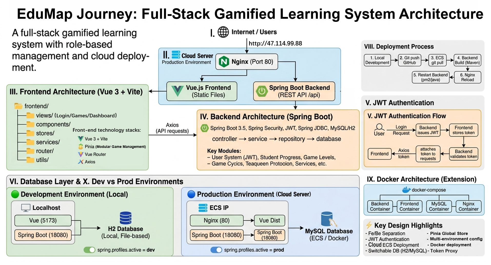
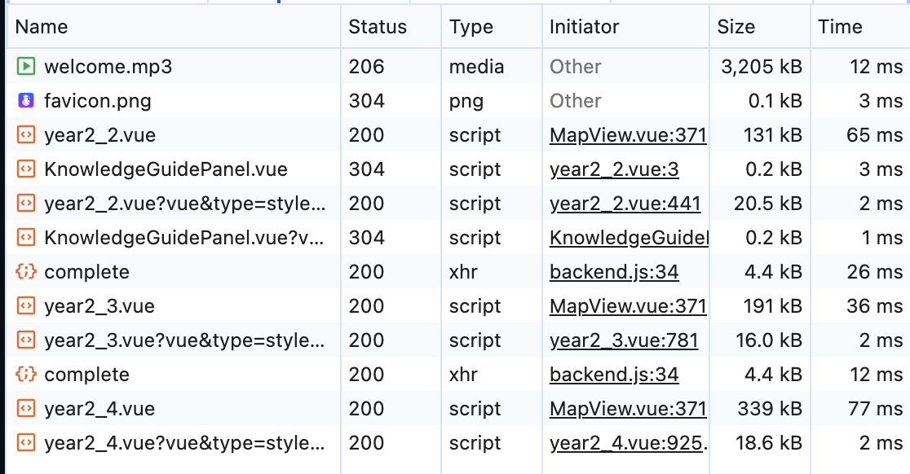
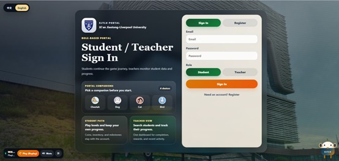
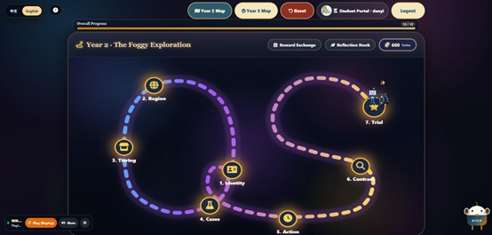
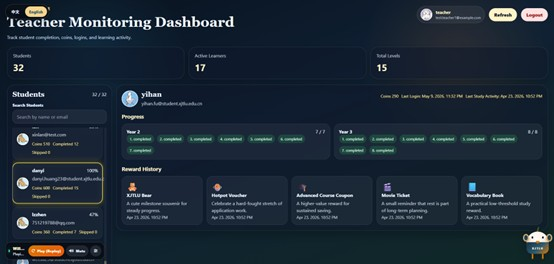

# EduMapJourney
 Project repository: https://github.com/danyih05/edujour

## Project Overview

EduJourney is a gamified postgraduate application planning platform designed to help students manage study-abroad preparation tasks through progression systems, rewards, and milestone tracking.

The platform supports both student and teacher roles:

- Students can register accounts, complete application-planning tasks, earn rewards, and track progress.
- Teachers can monitor student progress through a dedicated dashboard.

This project was developed as a coursework submission and demonstrates full-stack web application development using Vue 3, Spring Boot, JWT authentication, and relational database persistence.

---

# Running the Project

## Prerequisites

Please ensure the following software is installed:

- Node.js 18+
- Java 17+
- Maven 3.9+ (optional if using Maven Wrapper)
- (Optional) MySQL 8

---

# 1. Start the Backend

The backend can run directly using the embedded H2 database by default, so no separate database setup is required for local testing.

## Option A — Run with Maven (Recommended)

Open a terminal and run:

```bash
cd backend
mvn spring-boot:run
```

If Maven is not installed globally, you may use the Maven Wrapper instead.

### Windows

```bash
cd backend
mvnw.cmd spring-boot:run
```

### macOS / Linux

```bash
cd backend
./mvnw spring-boot:run
```

---

## Option B — Run Directly from IDE

You may also start the backend directly from the Spring Boot entry class:

```text
backend/src/main/java/com/gradquest/GradQuestApplication.java
```

In IntelliJ IDEA:

1. Open the `backend` project
2. Locate `GradQuestApplication.java`
3. Click run to start the backend

This will start the backend server without requiring Maven commands.

---

Backend default URL:

```text
http://localhost:18080
```

Health check endpoint:

```text
http://localhost:18080/api/health
```

---

# 2. Start the Frontend

Open another terminal and run:

```bash
cd frontend
npm install
npm run dev
```

Frontend default URL:

```text
http://localhost:5173
```

The frontend automatically proxies `/api` requests to the backend during local development.

Optional XJTLU Bird / DeepSeek assistant setup is documented separately in `frontend/XJTLU_BIRD_SETUP.md`. It is not required for the core game flow or coursework evaluation.

---

# 3. Register an Account

Before logging into the game, users must first register an account through the registration page.

For coursework demonstration purposes:

* Registration fields accept arbitrary values; no real personal data is required.
* No email verification is needed.
* Users can freely create new student or teacher accounts for testing.
* Account uniqueness is scoped by `(email, role)`, so the same identifier can be used once as a student and once as a teacher.

Example test account:

```text
Email: cpt208
Password: cpt208
```

*Note: The current demo build does not enforce strict email-format validation. The same identifier can also exist across different roles because registration and login are keyed by `(email, role)` rather than email alone.*

---

# AI Prompt Logs

The AI-assisted development logs for this submission are stored in `ai-logs/`. This repo uses `ai-logs/` as the tracked prompt-log folder referenced by the coursework requirement that was phrased as `/ailogs`.
Some raw `v1_*` prompt files preserve exploratory HTML-stage ideas that were later narrowed during Vue implementation; the final scope reconciliation is documented in `ai-logs/04-game-node-html-to-vue.md`.

---

# Features

## Student Features

* User registration and login with role selection
* JWT-based authentication
* Personalised game path recommendation based on user profile
* Progress tracking through **15 game nodes** that unlock step-by-step
* Shared map flow with onboarding, replayable completed nodes, and backend progress persistence
* Application-planning gameplay covering profile positioning, country and school strategy, materials preparation, personal statement logic, recommendation planning, timeline management, and interview readiness
* Task completion and skipping
* Reward and coin system linked to real-prize exchange
* Inventory management for virtual items
* In-app shop and item purchasing
* Healing sandbox / lightweight reflection board for peer-support-style messages
* Optional XJTLU Bird assistant backed by configurable DeepSeek browser chat
* Persistent profile, progress, inventory, and local replay-result storage

---

## Teacher Features

* Teacher account login
* Student monitoring dashboard
* Student progress inspection
* Progress overview for multiple students

---

# Project Architecture



## Data Handling Evidence

### Purpose of Data Handling

The EduJourney system was designed not only to display educational game content, but also to manage user input, interaction states, and learning progress throughout the study-abroad planning journey.

Because students interact with multiple game nodes, decision-making tasks, reward systems, and map-based progression states, the system needs to store, update, restore, and synchronise user progress across different sessions.

The data handling design ensures that student actions are not only temporary visual changes on the frontend. Instead, important interactions are converted into persistent progress data, stored through the backend, and later reused by both the student map interface and the teacher dashboard.

### User Input Handling

On the student side, each learning activity is implemented as a Vue game page, such as `year2_2.vue`, `year2_3.vue`, `year2_4.vue`, and the Year 3 game pages.

The system handles different forms of user interaction, including:

- selecting a Year 2 or Year 3 journey route;
- completing or skipping map nodes;
- choosing answers or making decisions in game tasks;
- updating profile-related information;
- earning reward coins;
- redeeming shop items;
- submitting reflective or interactive content.

When a student finishes a task, the game page emits a `complete` event with related data such as `rewardCoins`, `resultData`, `language`, or `profile` information. This event is handled by `GameContainer.vue` or `MapView.vue`, which then saves the local game result and calls the Pinia game store.

### Interaction State Management

The main interaction state is managed in:

```text
frontend/src/stores/game.js
```

This Pinia store manages important gameplay and progress states, including:

- selected year;
- current map node;
- unlocked levels;
- completed or skipped levels;
- coins;
- inventory items;
- shop items;
- traveler profile;
- local game results.

For example, `saveLevelResult()` stores local completion evidence, while `completeNode()` sends the completion data to the backend. After the backend responds, `applyProgress()` merges the returned progress data into the frontend state.

This allows the map interface to update visible progress states such as completed nodes, newly unlocked nodes, current position, and updated coin balance.

The frontend also uses local storage for some interaction continuity, such as local game result evidence and UI state. This helps users re-enter completed activities without losing their previous result state.

### Frontend-Backend Data Flow

The system follows a frontend-backend separation model. The frontend captures user actions through Vue components and synchronises important progress changes with the Spring Boot backend through RESTful APIs.

API communication is implemented in:

```text
frontend/src/services/backend.js
frontend/src/utils/api.js
```

The Axios client uses:

```text
baseURL: /api
```

and automatically attaches the JWT token from browser storage as an `Authorization` header.

When a student completes a level, the frontend calls:

```text
POST /api/progress/complete
```

This is implemented through the `completeLevel()` function in `backend.js`.

The browser Network panel shows this as a `complete` XHR request with status `200`, initiated from `backend.js`. This proves that the student's interaction is successfully sent from the Vue frontend to the Spring Boot backend.



The actual data flow is:

```text
Vue game page interaction
-> complete event emitted from the game node
-> GameContainer.vue / MapView.vue handles the event
-> Pinia game store updates local interaction state
-> backend.js sends an authenticated Axios request
-> ProgressController receives the request
-> ProgressService validates progress and reward logic
-> ProgressRepository / UserRepository persist the state
-> H2 database locally or MySQL database in deployment
-> frontend refreshes map progress
-> TeacherService summarizes progress for the teacher dashboard
```

### Backend Processing and Persistence

On the backend, progress-related requests are handled by:

```text
ProgressController
ProgressService
ProgressRepository
UserRepository
InventoryRepository
```

When `ProgressController` receives `/api/progress/complete`, it reads the authenticated user from the Spring Security JWT context and passes the request to `ProgressService`.

`ProgressService` then checks:

- whether the user is a student;
- whether the level exists;
- whether the level is unlocked;
- whether rewards should be applied;
- whether profile data needs to be updated;
- whether the next level should be unlocked.

If the action is valid, the system marks the level as completed, awards coins, updates profile data if provided, and unlocks the next node.

Persistent data is stored through repository classes. For example:

- `ProgressRepository` updates the `level_progress` table;
- `UserRepository` updates user coins and `traveler_profile_json`;
- `InventoryRepository` handles inventory-related state.

In local development, the backend uses an embedded H2 file database:

```text
jdbc:h2:file:./data/gradquest
```

The H2 configuration uses MySQL compatibility mode, which helps keep local development close to the MySQL deployment environment.

For deployment or MySQL testing, the backend can run with the `mysql` profile and connect to a MySQL database instead. This matches the architecture diagram where the same Spring Boot backend can persist data to H2 locally or MySQL in production.

### Teacher Dashboard Evidence

The teacher dashboard reuses the same persisted progress data. It does not rely on temporary frontend state.

`TeacherService` reads student progress records and calculates advisor-facing evidence, including:

- completed level count;
- skipped level count;
- unlocked level count;
- locked level count;
- total levels;
- completion rate;
- coins;
- last progress time.

This data is returned through:

```text
GET /api/teacher/students
```

The teacher dashboard then displays this information so advisors can monitor student engagement and progress.

This shows that user interactions are transformed into measurable progress evidence for both students and teachers.

### Evidence of Data Handling

The following evidence demonstrates that EduJourney correctly manages user input and interaction states:

- Vue game pages emit completion events after student actions;
- `GameContainer.vue` and `MapView.vue` handle completion events;
- `frontend/src/stores/game.js` stores and updates interaction state;
- `frontend/src/services/backend.js` sends progress requests to the backend;
- the Network panel shows `complete` XHR requests returning status `200`;
- `ProgressController` and `ProgressService` process completion requests;
- `ProgressRepository` persists progress into the database;
- H2 is used for local persistence and MySQL is supported through the `mysql` profile;
- `TeacherService` converts stored progress data into teacher dashboard evidence.

Therefore, EduJourney's data handling mechanism proves that student input is captured, synchronised, persisted, restored, and transformed into advisor-facing progress evidence.

```text
edujour/
├─ frontend/                      # Vue 3 + Vite client
│  └─ src/
│     ├─ views/                   # Page-level views (Login, Map, Teacher dashboard, game nodes)
│     ├─ components/              # Reusable UI components (shop, guide, music, sandbox, etc.)
│     ├─ stores/                  # Pinia state modules (auth, game, language)
│     ├─ services/                # Backend API service wrappers
│     ├─ router/                  # Vue Router route definitions
│     ├─ config/                  # Game-level and recommendation configs
│     ├─ composables/             # Reusable composition hooks
│     └─ i18n/                    # Internationalization resources (en/zh)
└─ backend/                       # Spring Boot API
   └─ src/main/java/com/gradquest/
      ├─ web/                     # REST controllers
      ├─ service/                 # Business logic services
      ├─ repository/              # Data access layer
      ├─ model/                   # Entity/data models
      ├─ dto/                     # Request/response DTOs
      ├─ security/                # JWT auth filter and token service
      ├─ config/                  # Security and app configuration
      ├─ data/                    # Initial data seeding/catalog
      ├─ exception/               # Global exception handling
      └─ GradQuestApplication.java
```

---

# Technology Stack

| Layer          | Technology                        |
| -------------- | --------------------------------- |
| Frontend       | Vue 3 + Vite + Vue Router + Pinia |
| Backend        | Spring Boot                       |
| Database       | MySQL / H2                        |
| Authentication | JWT                               |
| Build Tools    | Maven + npm                       |

---

# Main API Endpoints

| Method | Endpoint                 | Description          |
| ------ | ------------------------ | -------------------- |
| POST   | `/api/auth/register`     | Register account     |
| POST   | `/api/auth/login`        | Login                |
| POST   | `/api/auth/logout`       | Logout               |
| GET    | `/api/auth/me`           | Get current user     |
| GET    | `/api/progress`          | Get student progress |
| POST   | `/api/progress/complete` | Complete task        |
| POST   | `/api/progress/skip`     | Skip task            |
| POST   | `/api/progress/reset`    | Reset progress       |
| GET    | `/api/shop/items`        | Get shop items       |
| POST   | `/api/shop/purchase`     | Purchase item        |
| GET    | `/api/inventory`         | Get inventory        |
| GET    | `/api/sandbox/messages`  | Get sandbox messages |
| POST   | `/api/sandbox/messages`  | Create sandbox message |
| GET    | `/api/teacher/students`  | Teacher dashboard    |
| GET    | `/api/teacher/students/{studentId}` | Student detail |
| GET    | `/api/health`            | Backend health check |

---

# Build Verification

Use the following commands to verify the current repository state.

## Backend compilation

```bash
cd backend
mvn -q -DskipTests compile
```

## Frontend production build

```bash
cd frontend
npm run build
```

## Backend tests

```bash
cd backend
mvn test
```

## Frontend unit tests

```bash
cd frontend
npm run test:run
```

## Frontend E2E tests

```bash
cd frontend
npm run e2e
```

The core compile checks for frontend and backend have been used for the final submission state. Unit and E2E commands are included so graders can repeat the wider verification set where the local browser/test environment supports it.

---

# AI-Assisted Development Logs

The AI-assisted development records are stored in:

```text
ai-logs/
```

The main prompt index is:

```text
ai-logs/00-prompts-log.md
```

Detailed component logs cover architecture, backend/data/security, frontend integration, mini-games, tests, documentation, and final refinements.

---

# Demo Notes

* Users may freely register new student or teacher accounts
* Login requires account registration first
* No email verification is required
* Teacher accounts can immediately access the monitoring dashboard
* The local default runtime uses the embedded H2 database
* MySQL support is included for persistent runtime testing

---

# Screenshots

## Login Page



---

## Student Dashboard



---

## Teacher Dashboard


